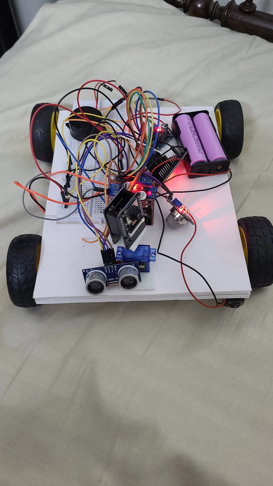
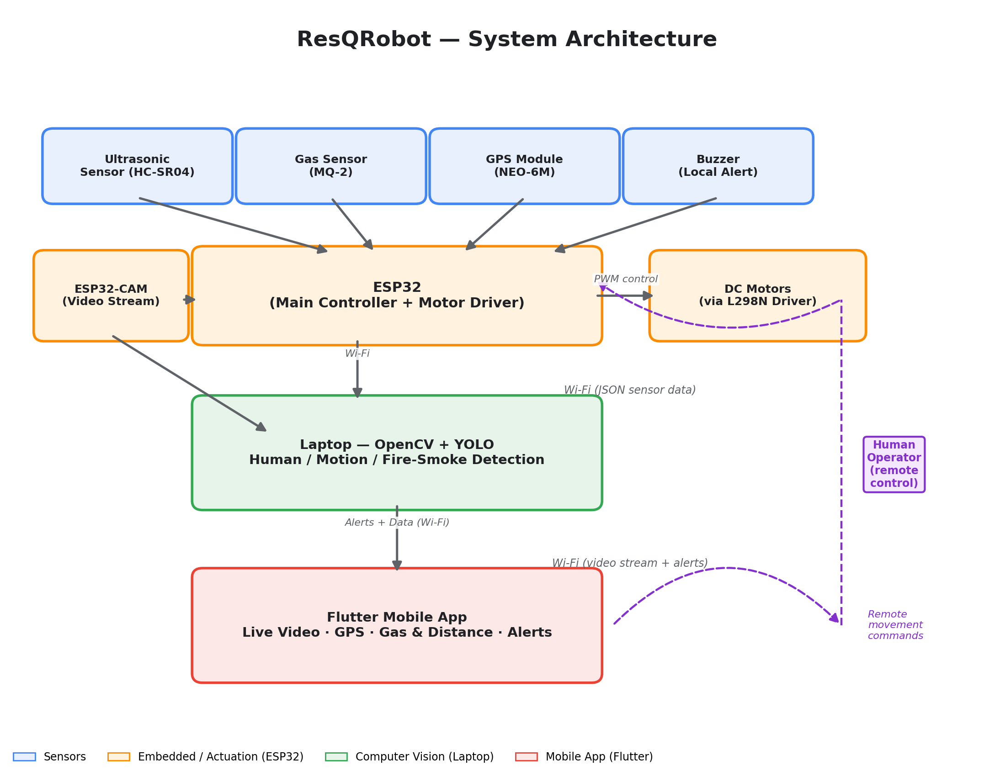

# Semi-Autonomous Search and Rescue Robot for Disaster Environment Monitoring and Hazard Localization

## ResQRobot - Smart Rescue Robot using ESP32

A smart IoT-based rescue robot designed to assist in disaster response and hazardous-environment assessment by remotely monitoring areas that may be unsafe for humans. The robot detects gas leaks, avoids obstacles, provides live location updates, streams video through an ESP32-CAM, and uses computer vision (OpenCV + YOLO) to detect humans, motion, and fire/smoke. All data and alerts are displayed on a Flutter-based mobile app for remote monitoring.

As climate change increases the frequency of wildfires, flooding, and resulting infrastructure damage, ResQRobot aims to reduce the need for responders to enter hazardous zones blindly — replacing blind entry with informed entry during the critical early phase of disaster response.

> **Note:** This project is currently under active development. See [Project Status](#project-status) below for what is implemented vs. in progress.

## Features

- **Live Camera Streaming** using ESP32-CAM
- **Gas Leakage Detection** using MQ-2 Gas Sensor
- **Obstacle Detection** using HC-SR04 Ultrasonic Sensor, with autonomous obstacle-stop
- **Human Detection** using a pretrained YOLO model on the live camera feed
- **Motion Detection** using OpenCV background subtraction
- **Fire/Smoke Detection** using OpenCV-based visual analysis
- **Buzzer Alert** for gas leaks and obstacles
- **Remote Robot Movement Control** (Forward, Backward, Left, Right, Stop) via mobile app
- **GPS Tracking** for real-time location
- **Flutter Mobile App** for live video, sensor data, location, and hazard alerts
- **Wi-Fi Connectivity** for remote access

## System Architecture

## Hardware Components

- ESP32 Dev Module
- ESP32-CAM
- FTDI Programmer (for flashing ESP32-CAM)
- HC-SR04 Ultrasonic Sensor
- MQ-2 Gas Sensor
- GPS Module (NEO-6M)
- L298N Motor Driver
- 2 x DC Gear Motors
- Buzzer
- Robot Chassis
- Wheels
- Li-ion Battery Pack with BMS
- Buck Converter (5V regulator)
- Jumper Wires / PCB

## Software & Tools

- Arduino IDE (ESP32 firmware)
- ESP32 Board Package
- Python
- OpenCV
- YOLOv8 (pretrained, for human detection)
- Flutter & Dart (mobile app)
- Wokwi Simulator (used for initial testing)
- Git & GitHub

## Working Principle

1. The ESP32 continuously reads data from the ultrasonic sensor and gas sensor, and tracks location via the GPS module.
2. The ultrasonic sensor measures the distance to nearby obstacles. If an obstacle is detected within the safety range, the robot autonomously stops to prevent collision.
3. The MQ-2 gas sensor monitors the environment for harmful/combustible gas. If concentration exceeds a set threshold, the buzzer is activated and an alert is generated.
4. The ESP32-CAM streams live video, which is processed on a laptop using OpenCV and a pretrained YOLO model to detect humans, motion, and fire/smoke.
5. All sensor readings, GPS location, camera feed, and CV-based hazard alerts are sent over Wi-Fi and displayed in real time on the Flutter mobile app.
6. A human operator remotely controls robot movement via the app, while the robot autonomously handles obstacle-stop, gas monitoring, and hazard alerting — a semi-autonomous design that keeps critical navigation judgment human-led while automating continuous safety monitoring.

## Mobile App

The Flutter app displays:

- Live camera feed
- Gas sensor value
- Obstacle distance
- Robot status and movement controls
- GPS location on a map
- Real-time hazard alerts (human/motion/fire detected, gas leak, obstacle)

## Applications

- Disaster response and search and rescue
- Post-flood structural and hazard assessment
- Wildfire-affected zone reconnaissance
- Hazardous gas monitoring
- Industrial inspection and mine safety
- Remote surveillance in inaccessible areas

## Project Status

- [x] Individual hardware components (ultrasonic, gas sensor, GPS, ESP32-CAM) tested independently
- [x] Hardware assembly complete
- [x] System architecture and communication pipeline finalized
- [ ] Full sensor-to-app integration (in progress)
- [ ] OpenCV + YOLO pipeline integration (in progress)
- [ ] Flutter app development (in progress)
- [ ] End-to-end field testing

## Future Improvements

- Fine-tuned/custom-trained detection models for fire and smoke
- Autonomous path planning
- LoRa or cellular connectivity for extended range in areas without Wi-Fi infrastructure
- Voice control
- Cloud data logging and post-mission incident reports
- Ruggedized, IP-rated enclosure for field deployment

## Team Members

### Ansha Mehrin M N
- System design and project integration
- ESP32 firmware development
- ESP32-CAM programming
- GitHub repository management
- Project documentation

### Aavanthika M Nair
- System design and project integration
- Hardware assembly, wiring, and mechanical setup
- Sensor integration and testing
- Robot chassis setup
- Assistance with hardware testing

### Arsha Karinkallayi
- System design and project integration
- Sensor integration and testing
- Hardware assembly, wiring, and mechanical setup
- Assistance with hardware testing

### Abhay Arakkal
- Computer vision pipeline development (OpenCV, YOLO integration)
- Flutter mobile app development
- Sensor data and alert integration with the app
- Testing and validation of detection accuracy

Electronics and Communication Engineering
Model Engineering College, Thrikkakara
Kerala, India
